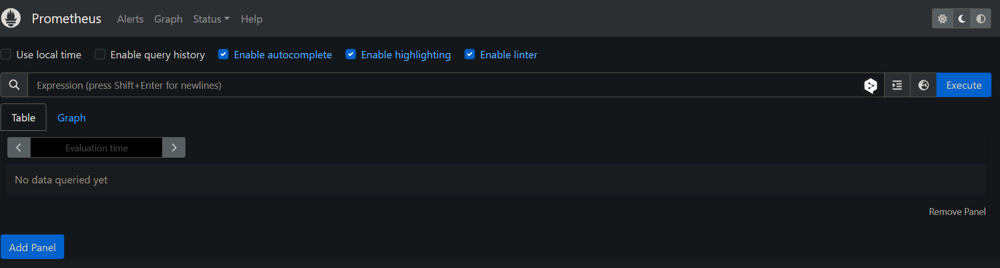
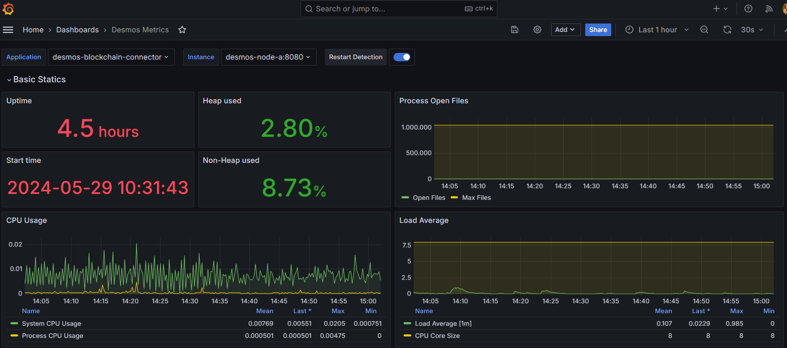
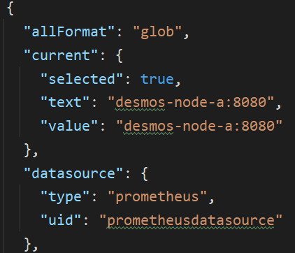

<h1>Monitoring System</h1>

---

# Introduction

This documentation details the integration and use of Prometheus and Grafana components to obtain application metrics. These tools allow you to effectively monitor application behaviors and performance in real time. Through this integration, you will be able to visualize important metrics, identify trends, and set alerts to maintain optimal performance. We will use Prometheus as a source of metrics data for Grafana to use and expose through panels that will form a dashboard.

---

## Installation

Once the necessary dependencies have been added, including Actuator and Micrometer, and the Actuator endpoints have been enabled in our configuration file, we can start with the implementation of these components. Actuator will allow us to expose various application management endpoints, while Micrometer will help us to collect and expose custom metrics of our application for further analysis and visualization. (For more details on these prerequisites you can visit this link [Monitoring Made Simple: Empowering Spring Boot Applications with Prometheus and Grafana](link)).

For the installation of these tools we will use a docker-compose file with the Prometheus and Grafana images and configure the necessary environment variables mapping the image volumes to use custom configurations.

In this case, we will have to edit 3 files `prometheus.yml`, `dashboards.yml`, and `datasources.yml` to establish:

### Prometheus.yml

This Prometheus configuration file defines global parameters and scraping settings to collect metrics from the application.

**Global Configuration:**

- `scrape_interval`: Defines the time interval between each metric scrape. This means that Prometheus will attempt to collect metrics from its targets at regular intervals.
- `evaluation_interval`: Defines the time interval between each evaluation of recording and alert rules. Prometheus evaluates its rules periodically.

**Scraping Configurations (`scrape_configs`):**

- `job_name`: Name of the scraping job. This name identifies the set of metrics that are being scraped from the application.
- `metrics_path`: Specifies the path where Prometheus can find the exposed metrics.
- `static_configs`: Static configuration of scraping targets.
    - `targets`: List of targets that Prometheus should scrape. This indicates the addresses and ports of the metric endpoints.
    - `labels`: Additional labels added to the scraped metrics.
        - `application`: Adds a label called application with a value that identifies the specific application from which the metrics are being collected.

### Datasources.yml

This configuration file defines the data source that Grafana will use to obtain metrics from Prometheus.

**API Version:**

- `apiVersion`: Defines the API version used for the file configuration. In this case, it is version 1.

**Data Sources Configuration (`datasources`):**

- `name`: Prometheus: Defines the name of the data source. In this case, it is called Prometheus.
- `type`: prometheus: Specifies the type of data source. Here, the type is prometheus, indicating that the data source is a Prometheus server.
- `access`: proxy: Defines the access method to the data source. proxy indicates that Grafana will access Prometheus through a proxy.
- `url`: http://prometheus:9090: Specifies the URL where the Prometheus server is located. In this case, Prometheus is accessible at http://prometheus:9090.
- `isDefault`: true: Indicates that this data source will be the default for Grafana. This means that if a different data source is not specified, Grafana will use this one by default.
- `uid`: Provides a unique identifier (UID) for the data source. This UID can be used to reference this data source elsewhere in Grafana's configuration.

### Dashboards.yml

This configuration file defines how Grafana will manage and provide the dashboards that will use the metrics collected by Prometheus.

**API Version:**

- `apiVersion`: Defines the API version used for the file configuration. In this case, it is version 1.

**Dashboard Providers (`providers`):**

- `name`: Name of the dashboard provider. Here, it is called 'Dashboard provider'.
- `type`: Type of provider. In this case, it is file, indicating that the dashboards will be provided from files.
- `disableDeletion`: Set to false, which means that the option to delete dashboards from Grafana will not be disabled.
- `updateIntervalSeconds`: Defines the update interval in seconds. Grafana will check the dashboard files every 10 seconds for changes.
- `options`: Additional options for the dashboard provider configuration.
    - `path`: Defines the path where Grafana will look for dashboard files. In this case, `/etc/grafana/provisioning/dashboards/dashboard_files`.
    - `foldersFromFilesStructure`: Set to true, indicating that Grafana will organize dashboards into folders based on the file structure.

## Usage of Prometheus

---

Now we can test if our Prometheus metrics endpoint is enabled and working correctly. For this, we need to use the link containing the port of the application from which we want to request its metrics, for example, using `http://localhost:8080/prometheus` (the link format depends on what we have defined in our configuration file, we skip the word '/actuator' from our path). We will see something like this:

Here is where we can use PromQL-formatted queries to request the metrics exposed by the Prometheus endpoint.

## Usage of Grafana

---

To access Grafana once its instance is up, we can use an endpoint like `http://localhost:3000/login` and we will see a login form:

We can access it with the default user created by Grafana, where "admin" will be the username and password.

We will use Grafana as a data visualization tool and Prometheus as the source of that data. If our configuration files have the correct values, we will be able to pre-set a Prometheus instance as a database along with a specific dashboard to show metrics of our application, resulting in something like this:

## Dashboard Variables

---

In the case of our dashboard, two variables are required, named `Application` and `Instance`. These variables are essential for defining and filtering the metrics we want to monitor.

The `Application` variable is used to identify the application or service that is generating the metrics. This tag allows us to group and filter metrics by application on the dashboard.

On the other hand, the `Instance` variable is used to identify the specific instance of an application or service that is generating the metrics. This tag allows us to distinguish between different instances of the same application or service. (In the case of Desmos, we refer to the name of the container along with the internal port defined in the `prometheus.yml` file.)

Therefore, by using these two variables in our dashboard, we can customize and fine-tune our metrics visualization to specifically monitor the application and instance that interests us.

These values can be defined within a JSON that we use to create our dashboard, for example, in the following image I am defining that the default instance that will set our dashboard will be `desmos-node-a`.

But this will only serve to set a default value for our dashboard each time we enter Grafana, since Grafana will be based on the "jobs" that we have defined in our `prometheus.yml` file. Therefore, within our dashboard we can use a dropdown list to dynamically select among other containers that we have defined as new jobs in our `prometheus.yml` file.

## Current Panels

---

Below is the purpose of each panel on the "Desmos Metrics" dashboard, which is divided into three rows:

### Row 1: General System Information

---

* Panel 1: Instance Status
    * **Description:** Displays the status of the container, which can be "up" or "down".
    * **Type:** Stat
      
* Panel 2: Uptime
    * **Description:** Shows the time the application has been up since it was started.
    * **Type:** Stat
* Panel 3: Start time
    * **Description:** Displays the start date of the application in the format YYYY/MM/DD HH:mm.
    * **Type:** Stat
* Panel 4: Heap Used
    * **Description:** This panel shows the amount of heap memory used in the application.
    * **Type:** Gauge
* Panel 5: Non-Heap Used
    * **Description:** This panel shows the amount of non-heap memory used in the application.
    * **Type:** Gauge
* Panel 6: Process open files
    * **Description:** Displays the count of open files.
    * **Type:** Time series
* Panel 7: CPU usage
    * **Description:** Graph showing the CPU usage of the application.
    * **Type:** Gauge
* Panel 8: Load average
    * **Description:** The sum of the number of runnable entities queued to the available processors and the number of runnable entities that are running on the available processors averaged over a period of time.
    * **Type:** Time series

### Row 2: HTTP Statics

---

* Panel 1: HTTP Server Requests Count Rate
    * **Description:** This metric represents the rate of change of the count of HTTP requests over time.
    * **Type:** Time series
* Panel 2: HTTP Server Requests Sum Rate
    * **Description:** This metric represents the rate of change of the cumulative sum of the duration of HTTP requests over time.
    * **Type:** Time series
* Panel 3: HTTP Codes
    * **Description:** This metric represents the rate of change of the count of HTTP requests for all HTTP status codes over time.
    * **Type:** Time series
* Panel 4: HTTP Server Requests Max
    * **Description:** This metric represents the maximum recorded duration of HTTP requests for a specific instance and application.
    * **Type:** Time series

### Row 3: Logs Statics

---

* Panel 1: Info logs
    * **Description:** This metric represents the total number of events logged with the "info" log level in the logging system.
    * **Type:** Time series
* Panel 2: Error logs
    * **Description:** This metric represents the total number of events logged with the "error" log level in the logging system.
    * **Type:** Time series
* Panel 3: Warn logs
    * **Description:** This metric represents the total number of events logged with the "warn" log level in the logging system.
    * **Type:** Time series
* Panel 4: Debug logs
    * **Description:** This metric represents the total number of events logged with the "debug" log level in the logging system.
    * **Type:** Time series
* Panel 5: Trace logs
    * **Description:** This metric represents the total number of events logged with the "trace" log level in the logging system.
    * **Type:** Time series

## Additional Resources

- [Overview | Prometheus](https://prometheus.io/docs/introduction/overview/)
- [Grafana documentation | Grafana documentation](https://grafana.com/docs/grafana/latest/)
- [Micrometer Documentation :: Micrometer](https://docs.micrometer.io/micrometer/reference/)
- [Spring Boot Actuator: Production-ready Features](https://docs.spring.io/spring-boot/docs/2.5.6/reference/html/actuator.html)
- [Monitor a Spring Boot App Using Prometheus | Baeldung](https://www.baeldung.com/spring-boot-prometheus)
